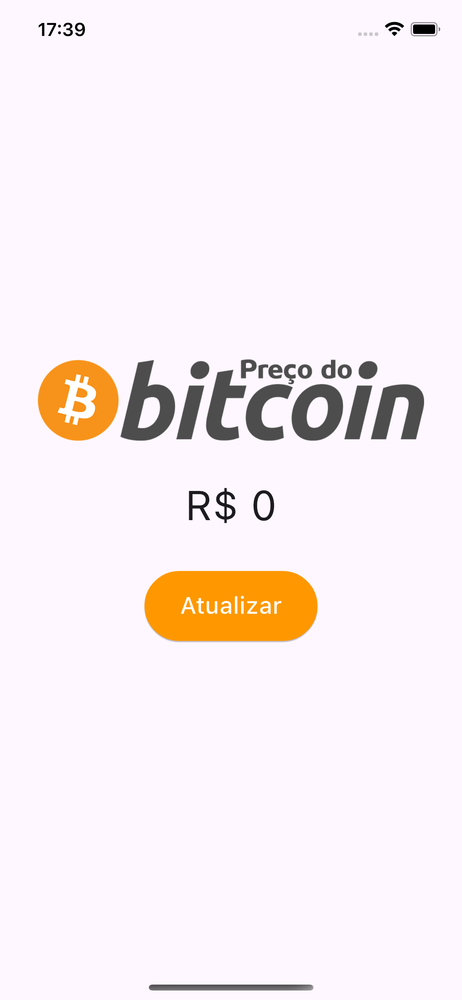
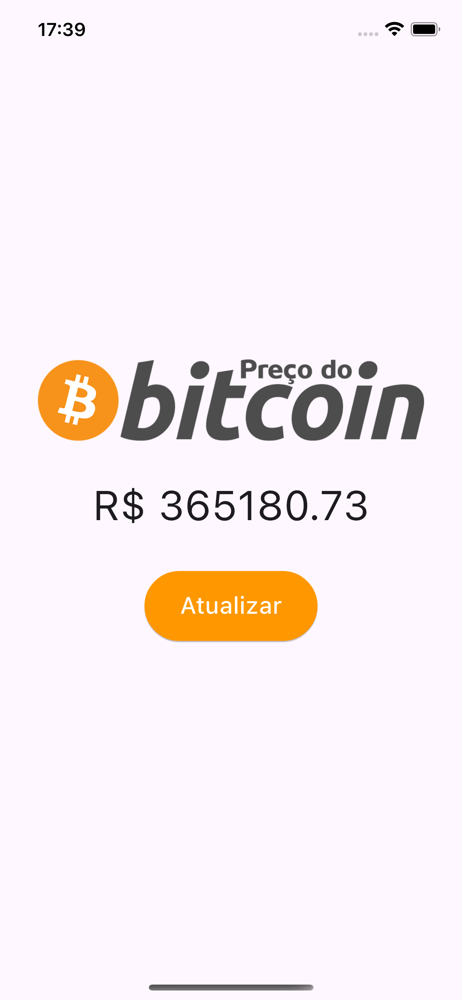

# App Preço Bitcoin

## Descrição

Um aplicativo desenvolvido durante o curso de Desenvolvimento Flutter Mobile, com o objetivo de entender e aplicar conceitos fundamentais na criação de um aplicativo que realiza requisições a uma api externa.

## Curso

**Desenvolvimento Android e IOS com Flutter - Crie 15 Apps**

[Link para o curso na Udemy](https://www.udemy.com/course/desenvolvimento-android-e-ios-com-flutter/?couponCode=MCLARENT71824)

## Status do Projeto

- **Concluído:** 12/10/2021
- **Atualizado:** 30/07/2024

## Tecnologias Utilizadas


## Funcionalidades

- Exibir o valor do bitcoin
- Consultar na API e exibir o valor atualizado

## Instalação

Siga os passos abaixo para rodar o projeto localmente:

1. Clone o repositório:
    ```sh
    git clone https://github.com/rafaelleonan/app-flutter-preco-bitcoin.git
    ```
2. Navegue até o diretório do projeto:
    ```sh
    cd app-flutter-preco-bitcoin
    ```
3. Instale as dependências:
    ```sh
    flutter pub get
    ```
4. Execute o aplicativo:
    ```sh
    flutter run
    ```

## Telas
<p>
  
  
</p>

## Video Demonstração
[Assista o vídeo](https://ucc97147493b21ca01321d7745ec.dl.dropboxusercontent.com/cd/0/inline/CXyWI0iu1x3lpV2bl6njKrXiZLpU4x6KIFEJqq9LqRVU_kH49AjcHpBcHR5h0nP2SkcSK85Hbcr_LxRLOMTHLd4BT6PlctpHZd846g6xj9kagdAVxydloXFldxPNt1yW9OM_4CRxvlHp4NwCBSAeOorY/file#)
